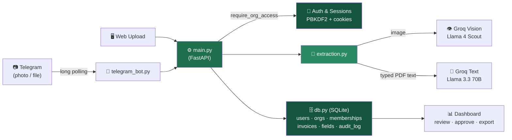

<div align="center">

<h1>🌿 Greenledger AI</h1>

<p><b>An AI-powered invoice intake, review, and approval system —<br/>configurable extraction, multi-tenant auth, and a live Telegram bot.</b></p>

[](https://greenledger-invoice-ai.onrender.com)
[](https://console.groq.com)
[](https://github.com/akshayy718)

🚀 Live App → [greenledger-invoice-ai.onrender.com](https://greenledger-invoice-ai.onrender.com/)

</div>

<div align="center">


</div>

*First load on the live demo may take ~30–60s (free-tier hosting wakes from sleep), and data resets periodically — this is a free-tier limitation, not a bug. Demo login: `demo@greenledger.ai` / `demo1234`, or sign up fresh in seconds.*

---

## 📌 Why this project is different

Most "AI invoice extraction" demos hardcode a fixed set of fields and assume every document looks the same. **Greenledger doesn't.**

It's built around one idea: **an admin defines what fields actually matter for their organization** — vendor, invoice number, tax, vehicle number, PO number, whatever — and the AI extracts exactly that, with a confidence score on every field so a human knows what to double-check. Nothing gets approved silently, and every correction is logged.

It also doesn't pretend OCR is good enough. Photos go straight to a **vision-capable LLM** that reads the image directly — the same reason it can correctly read a blurry, crumpled, hand-photographed receipt that traditional OCR returns blank on.

---

## 🏗️ Architecture



**One pipeline, two entry points.** Telegram and the web upload both call the exact same `process_invoice_file()` function — a photo sent from a phone gets identical treatment to a file dropped in the browser, including the same duplicate check, same confidence scoring, same audit logging.

---

## ✨ Features

| | |
|---|---|
| 🔐 **Real authentication** | Email/password signup, PBKDF2-hashed passwords (never plaintext), server-side sessions. Every org-scoped endpoint checks membership before returning data. |
| 🏢 **True multi-tenant isolation** | One login, many organizations — each with its own invoices, fields, and Telegram routing. Verified with a deliberate test: a second user gets a `403` trying to touch the first user's org. |
| 🧩 **Configurable extraction fields** | No hardcoded schema. Add, edit, deactivate fields per org, with optional hints that steer the AI ("this is the long number labeled Invoice No, not Receipt No"). |
| 👁️ **Vision-model extraction** | Images go straight to a vision LLM instead of OCR — reads blurry, angled, real-world photos the way a person would. Auto-corrects sideways phone photos via EXIF before sending. |
| 🎯 **Confidence scores** | Every field shows how sure the AI is. Low-confidence fields are visibly flagged for review — never silently trusted. |
| 🧾 **Line-item extraction** | Pulls individual billed items — description, qty, price, amount — not just header totals. |
| 🔁 **Re-extraction with hints** | Wrong field? Type a correction hint and re-run extraction on the same document instead of typing the fix by hand every time. |
| 🔍 **Duplicate detection** | Fingerprints vendor + invoice number + amount to flag likely-duplicate submissions automatically. |
| 🤖 **Live Telegram bot** | Send an invoice straight from your phone. The bot replies with a summary and routes it by chat ID — unlinked chats are refused outright. |
| 📝 **Full audit trail** | Every correction, re-extraction, and approval logged — old value → new value, who, when. |
| 📊 **Analytics** | Totals, approval status, spend by vendor, spend by month. |
| 📤 **Clean export** | One click to Excel or CSV — approved-only or everything — ready for accounting. |

---

## 🐛 Real bugs found and fixed while building this

These showed up against real usage, not in theory — each one taught something:

- **OCR returning blank on real-world photos** — Tesseract reliably failed on compressed, angled phone photos of receipts. Root cause wasn't fixable with image preprocessing alone; the actual fix was architectural — switching images to a **vision model** that reads the picture directly instead of OCR-then-read-text.
- **Sideways receipts** — a folded, photographed-at-an-angle receipt was being read upside down. Fixed by reading the image's EXIF orientation and auto-rotating before sending it to the AI.
- **Silent extraction failures** — when the AI call failed (missing key, bad image, rate limit), the app returned blank fields with zero explanation, making a real failure look identical to "the AI just didn't find anything." Fixed by surfacing a specific `diagnostic` string all the way to the UI (and the Telegram reply), so a failure says exactly why.
- **Fresh deploy crash** — `uploads/` is excluded from git (it holds user files), so a brand-new clone or deploy had no such folder, and the app crashed on startup trying to serve static files from a directory that didn't exist. Fixed with `os.makedirs(..., exist_ok=True)` before mounting it.
- **Cross-tenant data leak risk** — early versions trusted the `org_id` in the URL without checking who was asking. Closed by adding `require_org_access()` to every single org-scoped endpoint, and verified with a real test: a second account gets `403` trying to read the first account's invoices.
- **Cookie security vs. local dev** — marking the session cookie `secure` breaks login on plain `http://127.0.0.1` during local testing, but is required once deployed behind HTTPS. Fixed with an `IS_PRODUCTION` flag that auto-detects the hosting environment.

---

## 🛠️ Tech stack

<div align="center">

| Layer | Technology | Purpose |
|-------|-----------|---------|
| **Backend** | FastAPI (Python) | Routing, auth, business logic |
| **Database** | SQLite | Users, orgs, invoices, audit log |
| **AI — Vision** | Groq · Llama 4 Scout | Reads photos/scanned documents directly |
| **AI — Text** | Groq · Llama 3.3 70B | Reads typed PDF text layers |
| **Bot** | Telegram Bot API (long polling) | Phone-based invoice intake |
| **Auth** | PBKDF2 + httponly session cookies | Password hashing, login sessions |
| **Frontend** | Vanilla HTML / CSS / JS | No framework, no build step |
| **Hosting** | Render | Auto-deploy from GitHub |

</div>

---

## 📁 Project structure

```
greenledger-invoice-ai/
├── main.py            → FastAPI app: routes, auth, org access control
├── db.py               → SQLite schema, password hashing, sessions
├── extraction.py        → File reading + AI extraction (vision & text paths)
├── telegram_bot.py      → Long-polling bot, shares the extraction pipeline
├── static/
│   ├── index.html       → Dashboard (single-page, vanilla JS)
│   └── login.html        → Sign in / sign up
└── requirements.txt
```

---

## ⚡ Quick start

```bash
git clone https://github.com/akshayy718/greenledger-invoice-ai.git
cd greenledger-invoice-ai

pip install -r requirements.txt

export GROQ_API_KEY="your_groq_key"        # free at console.groq.com
export TELEGRAM_BOT_TOKEN="your_bot_token"  # optional — from @BotFather

uvicorn main:app --reload
```

Open `http://127.0.0.1:8000` → redirects to login → sign up, or use the auto-created demo account (`demo@greenledger.ai` / `demo1234`).

---

## 🎯 Things to try

| You do | What happens | Why it matters |
|---|---|---|
| Upload a clean PDF invoice | Every field extracts near-instantly at high confidence | The fast path — typed text, no AI guesswork needed |
| Send a receipt photo to the Telegram bot | Bot reads the image directly via vision AI, replies with a summary | Same pipeline as web upload, different entry point |
| Add a custom field in *Extraction Fields* | Next extraction includes it automatically | No hardcoded schema — the org defines its own shape |
| Type a hint and hit *Re-extract* | AI re-reads the same document with your correction in mind | Fixes systematic misreads without manual typing |
| Click *View history* on any invoice | Every edit, old → new, who, when | Real audit trail, not just a status flag |
| Sign up a second account | Lands in a brand-new, empty, fully isolated org | Multi-tenant by design, not by convention |

---

## 🔮 Future improvements

- [ ] Switch the Telegram bot from polling to **webhooks** — works on hosts that disallow always-on background tasks
- [ ] Self-service org invites — right now, linking a Telegram chat requires already being logged into the target org
- [ ] Postgres instead of SQLite, for real concurrent multi-user load
- [ ] Per-organization branding / custom field templates by industry

---

## ⚠️ Honest limitations

- **Free-tier hosting** — the app sleeps after 15 minutes idle (30–60s cold start) and the filesystem resets on restart. Fine for a demo, not for production data.
- **Vision AI isn't perfect** — dense, cluttered, or extremely low-quality photos can still produce a missed field. That's exactly why confidence scores and human review exist — verify-then-approve, not blind trust.
- **Telegram linking is admin-only** — a chat must be linked by someone already logged into the target org; there's no public self-link flow yet.

---

## 👨‍💻 Author

<div align="center">

**Akshay Santhosh** — AI/ML Engineer · SAP BTP Developer

[](https://www.linkedin.com/in/akshay-santhosh-435499208/)
[](https://github.com/akshayy718)
[](mailto:akshaysanthosh718@gmail.com)

</div>

<div align="center">

*Built with ❤️ using Python · FastAPI · Groq Vision AI · Telegram Bot API*

</div>
